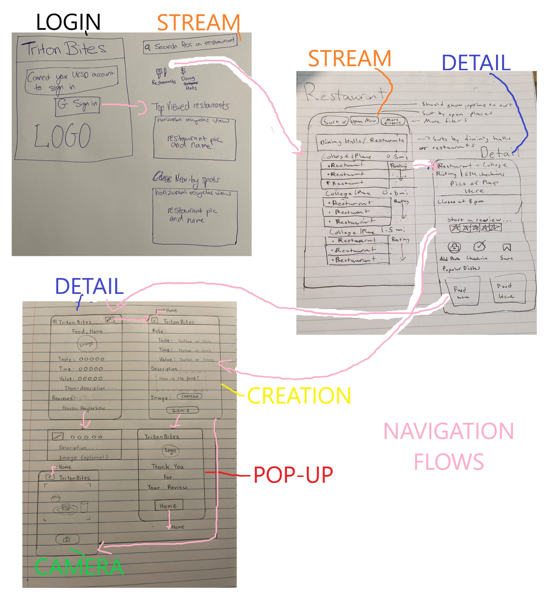

CodePath App Design Project - README Template
===

# Triton Bites

## Table of Contents
1. [Overview](#Overview)
1. [Product Spec](#Product-Spec)
1. [Wireframes](#Wireframes)
2. [Schema](#Schema)

## Overview
### Description
[Description of your app]
This app will allow for UCSD Students to rate food around San Diego as well as upload pictures.
### App Evaluation
[Evaluation of your app across the following attributes]
- **Category: Lifestyle/social/informational**
- **Mobile: At UCSD, people order food on the mobile app, MobileOrder. We are trying to improve the experience by allowing people to create and read reviews of the different food items, both from dining halls and restaurants. In addition, there may be some functionality that allows users to get live feedback on things such as availability and how many people are there.**
- **Story: This is the first app to do such a thing at UCSD.**
- **Market: This app is relevant to essentially every ucsd student and possibly even faculty who may want to see some opinions or even pictures of food before trying it.**
- **Habit: This app doesn't seem to have addictive features, but it is habit forming since users could check the reviews before ordering food daily.**
- **Scope: There is a lot of potential for further work and functionality beyond just food reviews, but the current idea and required stories are still quite valuable. We have clearly defined goals in regards to the food review aspect, but there is a lot of potential for future work regarding information that can be done.**

## Product Spec

### 1. User Stories (Required and Optional)

**Required Must-have Stories**

* Users should be able to see different food items
* Users should be able to review the food items
* Users should be able to take and upload pictures of the food 
* The app should show the username and creation time for each post
* Login information should be persisited through the app.
* User can log in and log out of their account. 

**Optional Nice-to-have Stories**

* Users should be allowed to upvote other's ratings as a sign of agreement in opinion.
* Users can open the app offline and see last loaded.
* Users can leave 'live' feedback to know things like current occupancy status.

### 2. Screen Archetypes

* [Login]
   * [Users should be able to login with their UCSD student account]
* [Home]
   * [Users can search for dining halls/restaurants]
   * [Users can view popular and nearby dining halls/restaurants]
* [Show all Dining Halls/Restaurants]
   * [Users should be able to see the dining halls/restaurants sorted with filters]
   * [Users can see the dining hall/restaurant ratings and proximity]
* [Restaurant Details]
   * [Users should be able to tap a button to write a review]
   * [Users should be able to check-in to the restaurant]
   * [Users should be able to "save" the restaurant, for quick access in the future]
   * [Users should be able to see popular dishes and the full menu]
* [Food Details]
   * [Users should be able read reviews on specific food items]
   * [Users should be able to view images, average ratings, and item description]
* [Create Review]
   * [Users can write a review and rate the food]
   * [Users can take a picture of the food for the review]
   * [Users receive a "thank you" pop-up after submitting a reivew]

### 3. Navigation

**Tab Navigation** (Tab to Screen)

* Home Feed
* Post new Review

**Flow Navigation** (Screen to Screen)

* Login
   * Home
* Register
   * Welcome Pop-up/Toast
   * Home
* Home
    * Dining Hall Details
    * Personalized Feed
    * Post new Review
* Review Details
    * Related Reviews

## Wireframes
[Add picture of your hand sketched wireframes in this section]

### [BONUS] Digital Wireframes & Mockups

### [BONUS] Interactive Prototype

## Schema 
### Models

- Review:

   | Property      | Type     | Description |
   | ------------- | -------- | ------------|
   | objectId      | String   | unique id for the user review (default field) 
   | user          | Pointer to User| user who wrote the review 
   | rating        | File     | stars out of 5
   | food review image         | File     | image that user posts 
   | review text   | String   | text from user review |
   | upvote        | Number   | number of upvotes for the review 
   | downvote      | Number   | number of downvotes for the review 
   | createdAt     | DateTime | date when review is created (default field) |
   
- Food:

   | Property      | Type     | Description |
   | ------------- | -------- | ------------|
   | objectId      | String   | unique id for the user review (default field) 
   | restaurant          | Pointer to Restaurant | restaurant where food can be found
   | food image         | File     | image that user posts 
   | food description        | String   | number of upvotes for the review 

   
- Restaurant:

   | Property      | Type     | Description |
   | ------------- | -------- | ------------|
   | objectId      | String   | unique id for the user review (default field) 
   | restaurant          | String | name of the restaurant
   | description   | String   | resaurant description |
   | location    | MapObject | location of the restaurant |
   
   
   
### Networking
#### List of network requests by screen
   - Login Screen
       - (Read/GET) Query for Google login
   - Home Feed Screen
      - (Read/GET) Query for all restaurants or food.
      - (Read/GET) Query for popular restaurants.
      - (Read/GET) Query for nearby restaurants.
   - Restaurant Screen
       - (Read/GET) Query for filtered restaurants.
   - Restaurant Detail Screen
       - (Read/GET) Query for opening and closing time.
       - (Read/GET) Query for check-ins.
       - (Read/GET) Query for restaurant rating.
       - (Create/POST) Create a new review object.
       - (Read/GET) Query for popular food items.
       - (Read/GET) Query for all food items.
   - Create Review Screen
      - (Create/POST) Create a new review object.
      - (Create/POST) Create a new upvote on a post.
      - (Delete) Delete existing upvote.
      - (Create/POST) Create a new downvote on a post.
      - (Delete) Delete existing downvote.
   - Food Detail Screen
       - (Read/GET) Query for food name.
       - (Read/GET) Query for food image.
       - (Create/POST) Create taste rating.
       - (Create/POST) Create time rating.
       - (Create/POST) Create value rating.
       - (Read/GET) Query for reviews.
